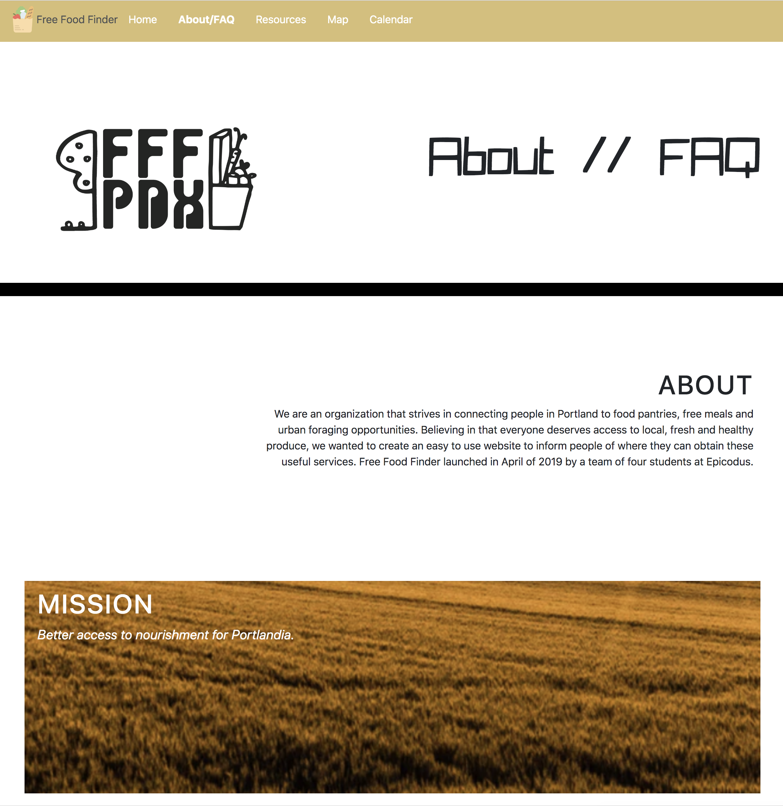
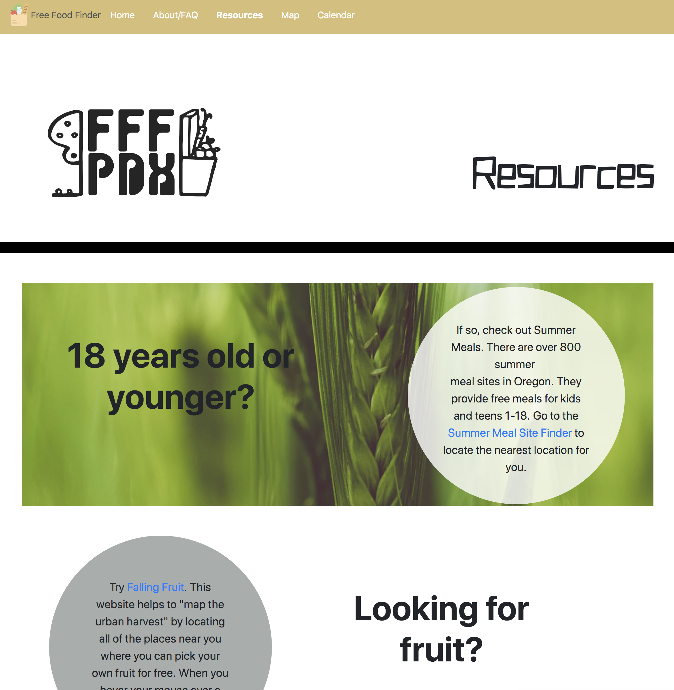
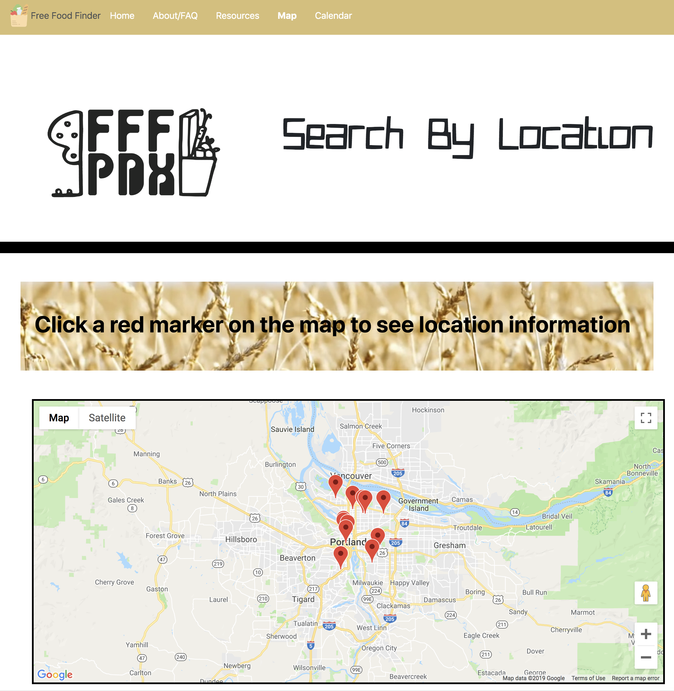
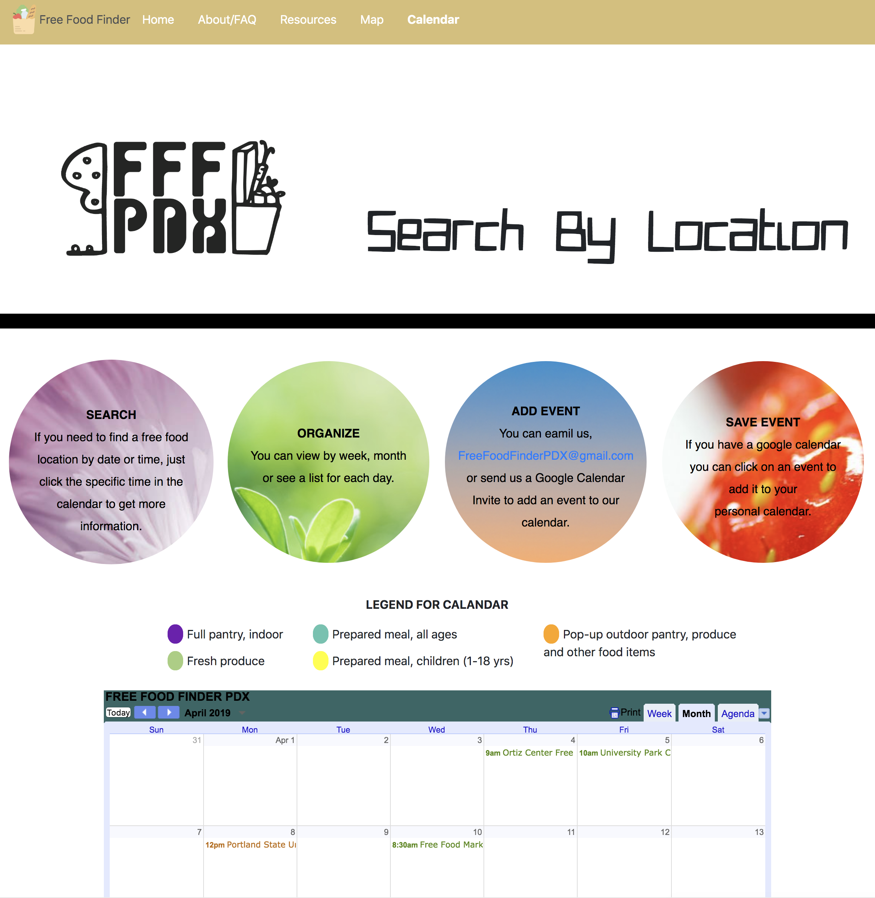

# _Free Food Finder_

#### _Intro to Programming, Week 5 Group Project, 04.18.2019_

#### By _Brooke Kullberg, Megan Schulte, Ashley J. Ancheta, and Hannah Melendy_

## Description
_This is a website that helps users easily locate free food-pantries and meals across Portland, OR. As such, we call it "Free Food Finder PDX" (FFF-PDX). The landing page displays the FFF-PDX logo, a menu bar and a display that shows the free grocery and meal events of the day, a quick about-us blurb, and a notice about the fruit and vegetables that are currently in season within the area. The menu bar allows the user to navigate to through the five FFF-PDX webpages: about page, resources page, calendar page, map page, and a link back to the homepage._

_The about page provides details about FFF-PDX, including a mission statement, a how-to/FAQ, contact information, and links to social media._

_The resources page provides information about further resources to our users: a link to Portland's public transit, Trimet, for planning your trip; a link to the Oregon Food Bank, Oregon's largest nonprofit free food distributor and organizer; a link to Portland's Multnomah county government website that details government food programs; a link to summer meals, a program specifically for kids up to 18 years old that provides a combination of breakfast, lunch, snacks and supper meals; and finally, a link to Falling Fruit, a crowd-sourced world-wide website that pins fruit trees on a map so that people that forage for free food around their town._   

_The calendar page and the map page showcase the two ways that we provide information from our database of free food locations: (1) organized and color-coded on an embeded google calendar, listing events by the date and time that they occur, and (2) organized by location in a map of Portland, implementing the googlemaps API to visually display our database of free food locations with extensive details about each location._

_We are not the only food locator out there, but we are proud of the dynamic way of searching for and displaying the vast array of free food locations available. We hope to make a tangible difference in the lives of Portlanders, and continue to refine this site to be in greater service to the community._

## Specs - "Landing Page" - index.html

  .png" alt="image of homePage" height="80%" width="80%">

| Behavior | Input | Output |
| ------------- |:-------------:| -----:|
| Navigate to FFF-PDX website pages | click an option from the menu bar | The click will take you to the selected page |
| Dynamic display of daily events, a welcome note, and in-season foods on landing page| Mouse hover over section of the infographic table | the selected section will grow to show contents, while the two other sections will shrink |
| Display the season of 8 different vegetables and fruit | mouse hover over picture | the picture will flip and display the name of the food and its season |

## Specs - "About Us" - about-faq.html

  

| Behavior | Input | Output |
| ------------- |:-------------:| -----:|
| Display About, Mission and Contact Us information | Scroll with mouse | paralax scrolling of background image |
| Connect users to social media | Click a social media icon | Link takes user to the FFF-PDX account on the selected social media site |
| Display FAQ | Mouse hover over a question | The answer slides in place of the original question, in the form of bullet points |

## Specs - "Resources" - resources.html

  

| Behavior | Input | Output |
| ------------- |:-------------:| -----:|
| Display community resources for free food opportunities | Scroll through page | Paralax scrolling display of background images |
| Provide links to outside websites | User clicks link in info-bubble | the link navigates away from FFF-PDX, taking the user to the new site |

## Specs - "Search by location" - searchByLocation.html

  

| Behavior | Input | Output |
| ------------- |:-------------:| -----:|
| Search for food by location | Click on a red marker on the map | info window will pop up in map with location name, and a section with detailed information about that location will display below the map |
| Switch between markers on the map | Click the 'x' on the top right corner of the info window pop up on map | the info window and the informational section below the map will disappear |

## Specs - "Search by Date" - calendar.html

  

| Behavior | Input | Output |
| ------------- |:-------------:| -----:|
| Display how-to info circles to teach user how to use page | mouse hover over circle | the circle and font size grow |
| Search for food by calendar date | Click a title within a date box | An info box will pop up with detailed information about the location, including hours, location, offerings |
| Navigate out of calendar date info box | Click the "x" to close the info box | the info box will close, and let the user make a new selection |

## Setup/Installation Requirements - Option 1

* Open the website by typing in the following link into your web browser: https://brookezk.github.io/free-food-finder

## Setup/Installation Requirements - Option 1

* Open via GitHub repository by going to https://github.com/BrookeZK/free-food-finder.git.
* In your command line (Terminal or another program), navigate to your desktop.
* In your command line, type "git clone https://github.com/BrookeZK/free-food-finder.git" to clone the repository to your desktop.
* In your command line, navigate into the new folder "free-food-finder".
* Once inside "free-food-finder," type "open index.html," and your web browser will open to the home page of the free-food-finder webpage.

## Known Bugs

_There are no known bugs, but this webpage is best viewed on a full screen._

## Support and contact details

_Should any problems occur, or any bugs discovered, please contact Ashley Ancheta at ashleyjancheta@gmail.com_

## Technologies Used

_This program was written in HTML and JavaScript, using the JQuery library. It was styled with CSS, using Bootstrap as well as custom styling._

### License

*This software is licensed under MIT license.*

Copyright (c) 2019 **_Brooke Kullberg, Megan Schulte, Ashley J. Ancheta, and Hannah Melendy_**
